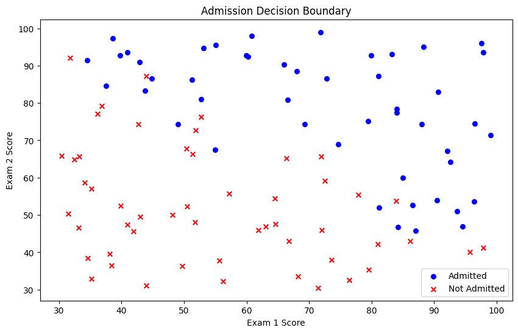
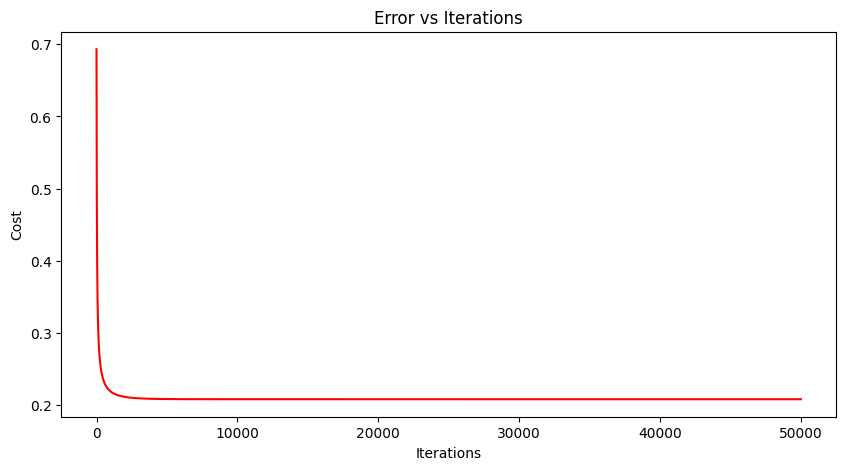
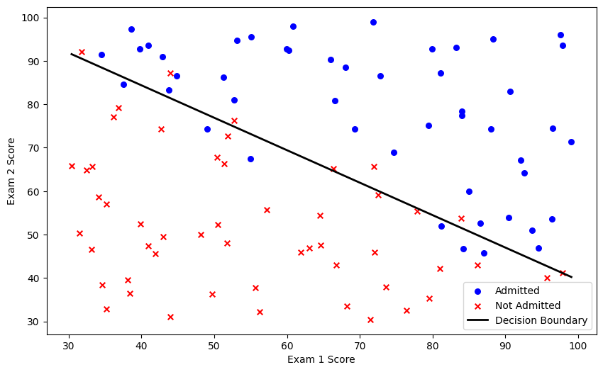

# Logistic Regression From Scratch

A pure NumPy implementation of logistic regression (no `sklearn`), trained to predict university admission from two exam scores. Built as a hands-on exercise to understand the mechanics behind gradient-descent-based classifiers, rather than calling a pre-built library.

## Dataset

`LogiReg_data.txt` — 100 samples, 3 columns: `Exam 1`, `Exam 2`, `Admitted` (0/1).

## Pipeline

| Module | Role | What it does |
|---|---|---|
| `sigmoid(z)` | Compressor | Maps any real number to a probability in (0, 1) |
| `model(X, theta)` | Predictor | Computes `sigmoid(X · θᵀ)` — probability of admission |
| `cost(X, y, theta)` | Scorer | Cross-entropy loss; measures how wrong current `theta` is |
| `gradient(X, y, theta)` | Compass | `mean((h(x) - y) · x)` — direction to adjust each `theta_j` |
| `descent(X, y, theta, alpha, iters)` | Optimizer | Repeatedly steps `theta -= alpha * gradient` |
| `predict(X, theta)` | Judge | Thresholds probability at 0.5 to get final 0/1 class |

**Core formulas:**

```
sigmoid:  g(z) = 1 / (1 + e^-z)
cost:     J(θ) = -1/m * Σ [ y·log(h) + (1-y)·log(1-h) ]
gradient: ∂J/∂θⱼ = 1/m * Σ (h(xᵢ) - yᵢ) · xⱼ⁽ⁱ⁾
update:   θⱼ := θⱼ - α · ∂J/∂θⱼ
```

## Key Implementation Notes

- **Bias term:** a column of `1`s is prepended to `X` so `θ₀` (intercept) can be folded into a single matrix multiplication `X · θᵀ`.
- **Feature scaling is essential.** Raw exam scores (30–100) produce wildly different gradient magnitudes per parameter, making a single learning rate `alpha` unstable — either near-zero progress or divergence (`log(0)` errors). Standardizing each feature (`(x - mean) / std`) before training fixes this.
- **`y` must stay 2D** (`(100, 1)`, not `(100,)`), otherwise NumPy broadcasting silently produces wrong shapes in `error = model(X, theta) - y`.

## Bugs Encountered & Fixed

1. `marker='o'` typo'd as `maker='o'` in `scatter()` → `AttributeError`.
2. `len(theta)` used instead of `theta.shape[1]` in the gradient loop — `theta` has shape `(1, 3)`, so `len()` returned `1` (row count) instead of `3` (parameter count), silently leaving two gradient components at 0.
3. Local variable named `cost` inside `descent()` shadowed the `cost()` function itself → `UnboundLocalError`.

## Results

- Initial cost (random guessing baseline): **0.6931** (`= -log(0.5)`)
- Converged cost (`alpha=0.1`, 5000 iterations, standardized features): **~0.208**
- Final `theta`: `[-0.557, 3.645, 4.822]`
- **Accuracy: 87%**

The ~13% misclassified points correspond to intentional label noise near the boundary — a linear decision boundary cannot separate them perfectly, and pushing accuracy to 100% on this data would indicate overfitting rather than a better model.

## Visualizations


- `data.png` — raw scatter plot (Admitted vs Not Admitted)

- `cost_curve.png` — loss vs. training iteration, showing convergence

- `boundary.png` — learned decision boundary overlaid on the scatter plot
